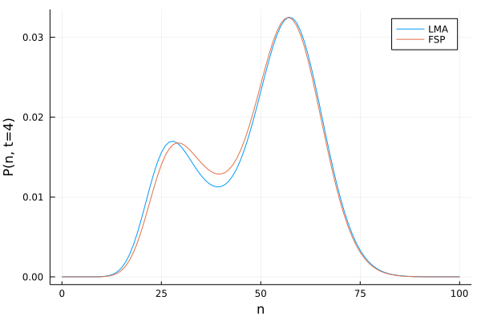

# [LMA Example](@id linear_mapping_approximation_example)

In this example, we demonstrate how the [Linear Mapping Approximation (LMA)](@ref linear_mapping_approximation) can be applied on chemical reaction networks using MomentClosure. We illustrate the approach on models of a simple nonlinear feedback loop and a genetic toggle switch, in turn reproducing some of the results published in the original [LMA](@ref linear_mapping_approximation) paper by Cao and Grima [1].

We start by considering a simple nonlinear gene regulatory network (GRN) shown in the diagram below (adapted from [1]):
```@raw html
⠀
```
Here we have a two-state gene promoter which can be in either state $G$ or $G^*$. As in a [previous example tutorial](@ref geometric-and-conditional), we interpret the gene as a distinct species modelled as a Bernoulli variable $g$, associating the states $G$ and $G^*$ with values $g=1$ and $g=0$ respectively. Protein $P$ is produced from both gene states $G$ and $G^*$ (with different rates $ρ_u$ and $ρ_b$) and can subsequently decay. The switch between $G$ and $G^*$ (or the feedback) is introduced via protein binding to the gene in state $G$.

The first step in applying the LMA is to transform the nonlinear GRN into a linear GRN. This can be done by removing the second-order reaction between $P$ and $G$, so that the reversible reaction $G+P \underset{σ_u}{\stackrel{σ_b}{\rightleftharpoons}} G^*$ is replaced by $G \underset{σ_u}{\stackrel{\bar{σ}_b}{\rightleftharpoons}} G^*$. This equivalent linear GRN can be visualised as (adapted from [1]):
```@raw html
⠀
```
Note that MomentClosure cannot automate this linearisation step as the choice of how the other reactions in the network are changed due to the removal of nonlinear reactions is arbitrary. For this reason, we define both nonlinear and linear GRNs using Catalyst as follows:
```julia
using Catalyst

# NOTE: both models MUST preserve the same ordering of reactions in order to detect
# how the nonlinear reactions are to be transformed using LMA

rn_nonlinear = @reaction_network begin
      @parameters σ_b σ_u ρ_b ρ_u
      σ_b, g + p → 0
      σ_u*(1-g), 0 ⇒ g + p
      ρ_u, g → g + p
      ρ_b*(1-g), 0 ⇒ p
      1, p → 0
end 

rn_linear = @reaction_network begin
      @parameters σ_b_LMA σ_u ρ_b ρ_u
      σ_b_LMA, g → 0      # typing ̄σ_b is not allowed it seems
      σ_u*(1-g), 0 ⇒ g
      ρ_u, g → g+p
      (ρ_b*(1-g)), 0 ⇒ p
      1, p → 0
end 
```
We can now apply the LMA to find the effective parameter $\bar{σ}_b$ and generate the corresponding moment equations of the linear GRN using MomentClosure's [`linear_mapping_approximation`](@ref):
```julia
using MomentClosure

# NOTE: we have to provide the indices of binary variables in the system as they are ordered in the *nonlinear* GRN.
# The distinction here between linear and nonlinear GRNs is important as in some cases the internal ordering of variables of the two Catalyst models can differ
@parameters t
@variables g(t)
binary_vars = [speciesmap(rn_nonlinear)[g]]

LMA_eqs, effective_params = linear_mapping_approximation(rn_nonlinear, rn_linear, binary_vars, combinatoric_ratelaws=false)
display(effective_params)
```
```julia
OrderedDict{Any, Any} with 1 entry:
  σ_b_LMA => σ_b*μ₁₁(t)*(μ₁₀(t)^-1)
```
We can also print out the moment equations:
```julia
using Latexify
latexify(LMA_eqs)
```
```math
\begin{align*}
\frac{d\mu{_{10}}}{dt} =& \sigma_{u} - \sigma_{b} \mu{_{11}} - \sigma_{u} \mu{_{10}} \\
\frac{d\mu{_{01}}}{dt} =& \rho_{b} + \rho_{u} \mu{_{10}} - \mu{_{01}} - \rho_{b} \mu{_{10}} \\
\frac{d\mu{_{11}}}{dt} =& \rho_{u} \mu{_{10}} + \sigma_{u} \mu{_{01}} - \mu{_{11}} - \sigma_{u} \mu{_{11}} - \sigma_{b} \mu{_{10}}^{-1} \mu{_{11}}^{2} \\
\frac{d\mu{_{02}}}{dt} =& \rho_{b} + \rho_{u} \mu{_{10}} + 2 \rho_{b} \mu{_{01}} + 2 \rho_{u} \mu{_{11}} + \mu{_{01}} - 2 \mu{_{02}} - \rho_{b} \mu{_{10}} - 2 \rho_{b} \mu{_{11}}
\end{align*}
```
Note that the results agree with Eqs. (1) and (2) (after a corresponding substitution) given in [1]. The moment equations are already closed, so we can solve them numerically and plot the mean protein number over time:
```julia
using OrdinaryDiffEq, Sundials, Plots

# [g, p] as in `species(rn_nonlinear)`
u₀ = [1.0, 0.001]
p = [0.004, 0.25, 25.0, 60.0]
tspan = (0., 15.)
dt = 0.1

u₀map = deterministic_IC(u₀, LMA_eqs)
oprob_LMA = ODEProblem(LMA_eqs, u₀map, tspan, p)
sol_LMA = solve(oprob_LMA, CVODE_BDF(), saveat=dt)

plot(sol_LMA, idxs=[2], label="LMA", ylabel="⟨p⟩", xlabel="time", fmt="svg")
```


To compare the LMA result to the true moment dynamics we use the Finite State Projection (FSP) algorithm implemented in [FiniteStateProjection.jl](https://github.com/kaandocal/FiniteStateProjection.jl). FSP can be much more efficient than SSA in accurately approximating the full time-dependent probability distribution of the given chemical system when the system's state space is small (hence it is particularly effective for the nonlinear GRN here). Having obtained the FSP solution, we can extract the time-evolution of moments using [`get_moments_FSP`](@ref) function and finally compare it to the LMA prediction. This can all be done as follows:

```julia
using FiniteStateProjection

fsp_sys = FSPSystem(rn_nonlinear, combinatoric_ratelaw=false)
# Truncate the state space of the system
# The gene has two states (G or G*) whereas we consider protein number from 0 to 100
state_space = [2, 101]

# The initial condition is the matrix of probabilities representing the state of the system
# We assume zero protein and the gene to be in the state G, hence the probability of this
# specific state should be set to 1 initially
u0 = zeros(state_space...)
u0[2, 1] = 1.0

# construct an ODE problem from the FSPSystem and solve it
fsp_prob = ODEProblem(fsp_sys, u0, tspan, p)
sol_FSP = solve(fsp_prob, CVODE_BDF(), saveat=dt)

# extract the 1st order raw moments from the FSP solution
μ_FSP = get_moments_FSP(sol_FSP, 1, "raw")
plot!(sol_FSP.t, μ_FSP[(0,1)], label="FSP", legend=:bottomright)
```


Using the LMA as implemented in MomentClosure, we can generate and solve the closed moment equations for any LMA-suitable nonlinear chemical reaction network, given that its linear equivalent is also provided. Proceeding further to obtain an approximate time-dependent probability distribution of the nonlinear network is more involved as only a handful of closed-form solutions of linear networks are known. Moreover, simply computing the solutions can be a challenge due to their complicated analytical form. For these reasons, MomentClosure does not provide an automated approach to computing the probability distributions of the relevant nonlinear systems using LMA—these steps have to performed manually on a case-by-case basis. Nevertheless, below we demonstrate how this could be done for the nonlinear GRN we have been considering so far.

The CME of the nonlinear feedback loop can be solved exactly as described in [1] and, for completeness, we write down the main result here. The probability distribution of the number of proteins $n_p$ at time $t$ is given by (*assuming* the initial conditions to be zero protein in state $G$):
```math
P \left( n_p, t \right) = \frac{1}{n_p!} \frac{d^{n_p}}{dw^{n_p}}\left( G_0(w, t) + G_1(w, t) \right) |_{w=-1},
```
where
```math
\begin{align*}
G_0(w, t) &= \exp(ρ_b w) \left[ f(we^{-t}) (-\rho_\Delta w)^{1-\Sigma} M(1-\bar{\sigma}_b, 2-\Sigma, -\rho_\Delta w) \\
+ g(we^{-t})M(1+\sigma_u,\Sigma,-\rho_\Delta w) \right],\\
G_1(w, t) &= \sigma_u^{-1} \exp(\rho_b w) \left[ -\sigma_u f(we^{-t})(-\rho_\Delta w)^{1-\Sigma} M(-\bar{\sigma}_b, 2-\Sigma, -\rho_\Delta w) \\
+\bar{\sigma}_b g(we^{-t}) M(\sigma_u, \Sigma, -\rho_\Delta w) \right],
\end{align*}
```
where $w=z-1$ and the probability generating functions are given by $G_i(z, t) = \sum_{n_p=0}^\infty z^{n_p} P_i(n_p, t)$. The function $M(\cdot,\cdot,\cdot)$ stands for the [Kummer's (confluent hypergeometric) function](https://en.wikipedia.org/wiki/Confluent_hypergeometric_function) and we also use the following definitions:
```math
\begin{align*}
      \rho_\Delta &= \rho_b - \rho_u, \\
      \Sigma &= \sigma_u + \bar{\sigma}_b + 1, \\
      f(w) &= \frac{\bar{\sigma}_b}{\Sigma-1}(-\rho_\Delta w)^{\Sigma-1}e^{-\rho_u w}M(\sigma_u, \Sigma, -\rho_\Delta w), \\
      g(w) &= \frac{\sigma_u}{\Sigma-1}e^{-\rho_u w} M(-\bar{\sigma}_b, 2-\Sigma, -\rho_\Delta w).
\end{align*}
```
One can observe that having a closed-form solution does not make life that much easier as now we have to find a way how to numerically evaluate these complicated mathematical expressions in a reasonably efficient manner. The main problem here is that in order to construct the probability distribution we have to take arbitrarily high $n^{th}$ order derivatives. Doing that symbolically is possible in principle but can be extremely computationally expensive as the symbolic expressions will be expanding exponentially in size with each higher derivative order: keeping them in memory is expensive and the same terms would have to be evaluated repeatedly many times. Similarly, naively nesting numerical derivative operations using an automatic differentiation framework is possible but still many redundant operations would need to be performed.

As pointed out by the authors in [1], a more efficient way is to expand the generating functions $G_0(w, t) + G_1(w, t)$ around $w=-1$ as then the $n^{th}$ Taylor series coefficient will be equivalent to the probability of having $n$ proteins at time $t$. This approach can be particularly effective: recursion relations for the Taylor coefficients of various elementary functions can be defined and in turn utilised to minimise the amount of redundant work which has to be performed when Taylor expanding any given mathematical expression. Such higher-order automatic differentiation framework in Julia is provided by
[TaylorSeries.jl](https://github.com/JuliaDiff/TaylorSeries.jl).

However, TaylorSeries only supports elementary function operations at the time and hence evaluating the Kummer's function $M(\cdot,\cdot,\cdot)$ requires some more work (these specialised numerics are readily available in more established scientific computing frameworks such as Mathematica but there's no fun in that). We can extend the TaylorSeries framework by constructing a function `t_pFq` that implements a recurrence relation between the Taylor coefficients for the generalized hypergeometric function `pFq` as defined in [HypergeometricFunctions.jl](https://github.com/JuliaMath/HypergeometricFunctions.jl). This can be done as follows (note that our construction is valid only for a single-variable Taylor series [`Taylor1`](https://juliadiff.org/TaylorSeries.jl/stable/api/#TaylorSeries.Taylor1)):
```julia
using TaylorSeries, HypergeometricFunctions
using HypergeometricFunctions: pFqweniger

# please let me know if a simpler and more efficient way to do this exists!
function t_pFq(α::AbstractVector, β::AbstractVector, a::Taylor1)
    order = a.order
    aux = pFqweniger(α, β, constant_term(a))
    c = Taylor1(aux, order)

    iszero(order) && return c

    coeffs = t_pFq(α.+1, β.+1, Taylor1(a[0:end-1], a.order-1))
    factor = prod(α)/prod(β)
    for k in 1:length(a)-1
        c[k] = sum(i * a[i] * coeffs[k-i] for i in 1:k) * factor / k
    end

    return c

end
```
We can now move on with the LMA procedure to obtain the probability distribution of the nonlinear GRN for the number of proteins at a chosen time point $t=4$. [Step 4](@ref linear_mapping_approximation) of the LMA involves obtaining the time-independent effective parameter $\bar{\sigma}_b$ which is given by its time-averaged value:
```julia
# calculate the raw moments up to time t at a fine temporal resolution
T = 4.0
tspan = (0., T)
dt = 0.001
oprob_LMA = remake(oprob_LMA, tspan=tspan)
sol_LMA = solve(oprob_LMA, CVODE_BDF(), saveat=dt)

# rebuild the symbolic expression for the effective parameter as a function of raw moments
μ_sym = [LMA_eqs.odes.states...]
p_sub = Dict.(Pair.(LMA_eqs.odes.ps, p)...)
avg_σ_b_sym = collect(values(effective_params))[1]
fn = build_function(substitute(avg_σ_b_sym, p_sub), μ_sym)
avg_σ_b = eval(fn)
# evaluate the time-averaged value of the effective parameter
@time σ_b_avg = sum(avg_σ_b.(sol_LMA.u)) * dt / T
```
We proceed with the very last steps of the LMA to obtain the probability distribution:
```julia
# need higher-precision numerics as Float64 can be unstable here due to very small numbers
# DoubleFloats is sufficient for this example and much more efficient than BigFloat
using DoubleFloats

# define the numerical values of the parameters
σ_u = p[2]; ρ_b = p[3]; ρ_u = p[4]
Σ = 1 + σ_b_avg + σ_u
ρ_Δ = ρ_b - ρ_u

n = 100 # expansion order (or max protein number to evaluate)
w₀ = -1 # value around which to expand

# compute the Taylor expansion (note the use of Double64)
w = w₀ + Taylor1(Double64, n)
@time f = σ_b_avg/(Σ-1)*exp(-T*(Σ-1))*exp(-ρ_u*w*exp(-T))*t_pFq([σ_u], [Σ], -ρ_Δ*w*exp(-T))
@time g = σ_u/(Σ-1)*exp(-ρ_u*w*exp(-T))*t_pFq([-σ_b_avg], [2-Σ], -ρ_Δ*w*exp(-T))

@time G00 = exp(ρ_b*w)*(f * t_pFq([1-σ_b_avg], [2-Σ], -ρ_Δ*w) +
                  g * t_pFq([1+σ_u], [Σ], -ρ_Δ*w) )

@time G11 = σ_u^(-1) * exp(ρ_b*w) * (-σ_u*f*t_pFq([-σ_b_avg], [2-Σ], -ρ_Δ*w) +
                                σ_b_avg*g*t_pFq([σ_u], [Σ], -ρ_Δ*w))

probs = (G00+G11).coeffs

# check that the probability distribution is more or less normalised to 1
# need higher numerical precision if not
isapprox(sum(probs), 1.0, rtol=1e-2)
```
```julia
0.009289 seconds (41.03 k allocations: 1.603 MiB)
0.009126 seconds (41.03 k allocations: 1.603 MiB)
0.067889 seconds (85.06 k allocations: 3.613 MiB)
0.066194 seconds (85.07 k allocations: 3.618 MiB)
true
```
Finally, we can plot the distribution and compare it to the FSP result:
```julia
plot(0:n, probs, xlabel="n", ylabel="P(n, t=4)", label="LMA", fmt="svg")
# plot the FSP probability of protein number by marginalising over the gene states
plot!(0:n, sum(sol_FSP[:, 41], dims=1)'[1:n+1], label="FSP")
```


## References

[1]: Z. Cao and R. Grima, "Linear mapping approximation of gene regulatory networks with stochastic dynamics", Nature Communications 9, 3305 (2018). [https://doi.org/10.1038/s41467-018-05822-0](https://doi.org/10.1038/s41467-018-05822-0)
