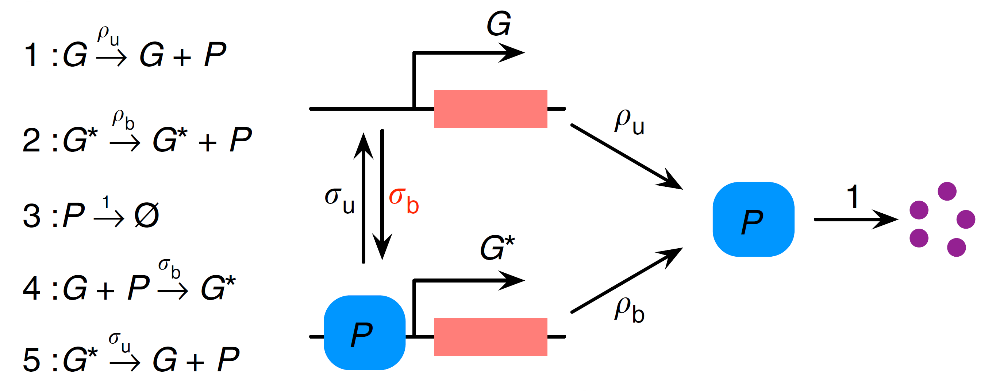
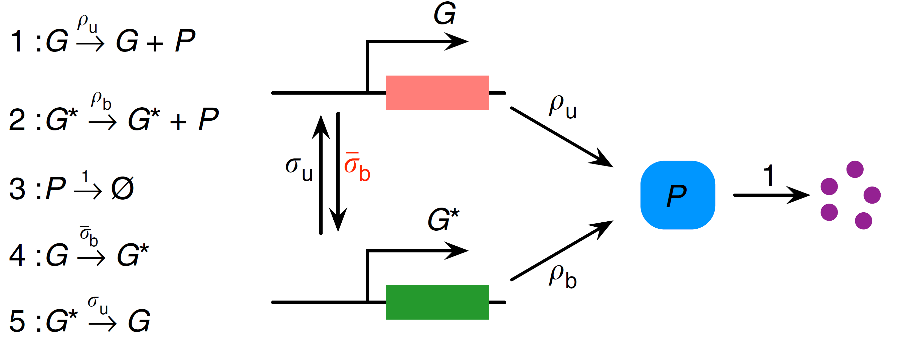

# [LMA Example](@id linear_mapping_approximation_example)

In this example, we demonstrate how the [Linear Mapping Approximation (LMA)](@ref linear_mapping_approximation) can be applied on chemical reaction networks using MomentClosure. We illustrate the approach on models of a simple nonlinear feedback loop and a genetic toggle switch, in turn reproducing some of the results published in the original [LMA](@ref linear_mapping_approximation) paper by Cao and Grima [1].

We start by considering a simple nonlinear gene regulatory network (GRN) shown in the diagram below (adapted from [1]):
```@raw html
⠀
```
Here we have a two-state gene promoter which can be in either state $G$ or $G^*$. As in a [previous example tutorial](@ref geometric-and-conditional), we interpret the gene as a distinct species modelled as a Bernoulli variable $g$, associating the states $G$ and $G^*$ with the values $g=1$ and $g=0$ respectively. Protein $P$ is produced from both gene states $G$ and $G^*$ (with different rates $ρ_u$ and $ρ_b$) and can subsequently decay. The switch between $G$ and $G^*$ (or the feedback) is introduced via protein binding to the gene in state $G$.

First step in applying the LMA is to transform this nonlinear gene regulatory network (GRN) into a linear GRN. This can be done by removing the second-order reaction between $P$ and $G$, so that the reversible reaction $G+P \underset{σ_u}{\stackrel{σ_b}{\rightleftharpoons}} G^*$ is replaced by $G \underset{σ_u}{\stackrel{\bar{σ}_b}{\rightleftharpoons}} G^*$. This equivalent linear GRN can be visualised as (adapted from [1]):
```@raw html
⠀
```
Note that MomentClosure cannot automate this linearisation step as the choice of how the other reactions in the network are changed due to the removal of nonlinear reactions is arbitrary. For this reason, we define both nonlinear and linear GRNs using Catalyst as follows:
```julia
using Catalyst

# NOTE: both models MUST preserve the same ordering of reactions in order to detect
# how the nonlinear reactions are to be transformed using LMA

rn_nonlinear = @reaction_network begin
      σ_b, g + p → 0
      σ_u*(1-g), 0 ⇒ g + p
      ρ_u, g → g + p
      ρ_b*(1-g), 0 ⇒ p
      1, p → 0
end σ_b σ_u ρ_b ρ_u

rn_linear = @reaction_network begin
      σ_b_LMA, g → 0      # typing ̄σ_b is not allowed it seems
      σ_u*(1-g), 0 ⇒ g
      ρ_u, g → g+p
      (ρ_b*(1-g)), 0 ⇒ p
      1, p → 0
end σ_b_LMA σ_u ρ_b ρ_u
```
We can now apply the LMA to find the effective parameter $\bar{σ}_b$ and generate the corresponding moment equations of the linear GRN using MomentClosure's [`linear_mapping_approximation`](@ref):
```julia
# NOTE: we have to provide the indices of binary variables in the system as they are ordered in the *nonlinear* GRN.
# The distinction here between linear and nonlinear GRNs is important as in some cases the internal ordering of variables of the two Catalyst models can differ
@parameters t
@variables g(t)
binary_vars = [speciesmap(rn_nonlinear)[g]]

LMA_eqs, effective_params = linear_mapping_approximation(rn_nonlinear, rn_linear, binary_vars, combinatoric_ratelaw=false)
display(effective_params)
```
```julia

OrderedDict{Any, Any} with 1 entry:
  σ_b_LMA => σ_b*μ₁₁(t)*(μ₁₀(t)^-1)
```
We can also print out the moment equations:
```julia
using Latexify
latexify(LMA_eqs)
```
```math
\begin{align*}
\frac{d\mu{_{10}}}{dt} =& \sigma_{u} - \sigma_{b} \mu{_{11}} - \sigma_{u} \mu{_{10}} \\
\frac{d\mu{_{01}}}{dt} =& \rho_{b} + \rho_{u} \mu{_{10}} - \mu{_{01}} - \rho_{b} \mu{_{10}} \\
\frac{d\mu{_{11}}}{dt} =& \rho_{u} \mu{_{10}} + \sigma_{u} \mu{_{01}} - \mu{_{11}} - \sigma_{u} \mu{_{11}} - \sigma_{b} \mu{_{10}}^{-1} \mu{_{11}}^{2} \\
\frac{d\mu{_{02}}}{dt} =& \rho_{b} + \rho_{u} \mu{_{10}} + 2 \rho_{b} \mu{_{01}} + 2 \rho_{u} \mu{_{11}} + \mu{_{01}} - 2 \mu{_{02}} - \rho_{b} \mu{_{10}} - 2 \rho_{b} \mu{_{11}}
\end{align*}
```
Note that the results agree with Eqs. (1) and (2) in [1] (after the corresponding substitution). The moment equations are already closed, so we can solve them numerically and plot the mean protein number over time:
```julia
using OrdinaryDiffEq, Sundials

# [g, p] as in `species(rn_nonlinear)`
u₀ = [1.0, 0.001]
p = [0.004, 0.25, 25.0, 60.0]
tspan = (0., 15.)
dt = 0.1

u₀map = deterministic_IC(u₀, LMA_eqs)
oprob_LMA = ODEProblem(LMA_eqs, u₀map, tspan, p)
sol_LMA = solve(oprob_LMA, CVODE_BDF(), saveat=dt)

plot(sol_LMA, vars=(0, [2]), label="LMA", ylabel="⟨p⟩", xlabel="time", fmt="svg")
```


To compare the LMA result to the true moment dynamics we use the Finite State Projection (FSP) algorithm implemented in [FiniteStateProjection.jl](https://github.com/kaandocal/FiniteStateProjection.jl). FSP can be much more efficient than SSA in accurately approximating the full time-dependent probability distribution of the given chemical system when the system's state space is small (hence it is particularly effective for the nonlinear GRN here). Having obtained the FSP solution, we can extract the time-evolution of moments using [`get_moments_FSP`](@ref) function and finally compare them to the LMA predictions. This can all be done as follows:

```julia
using FiniteStateProjection

fsp_sys = FSPSystem(rn_nonlinear, combinatoric_ratelaw=false)
# Truncate the state space of the system
# The gene has two states (G or G*) whereas we consider protein number from 0 to 100
state_space = [2, 101]

# The initial condition is the matrix of probabilities representing the state of the system
# We assume zero protein and the gene to be in the state G, hence the probability of this
# specific state should be set to 1 initially
u0 = zeros(state_space...)
u0[2, 1] = 1.0

# construct an ODE problem from the FSPSystem and solve it
fsp_prob = ODEProblem(fsp_sys, u0, tspan, p)
sol_FSP = solve(fsp_prob, CVODE_BDF(), saveat=dt)

# extract the 1st order raw moments from the FSP solution
μ_FSP = get_moments_FSP(sol_FSP, 1, "raw")
plot!(sol_FSP.t, μ_FSP[(0,1)], label="FSP", legend=:bottomright)
```


Using the LMA as implemented in MomentClosure, we can generate and solve the closed moment equations for any LMA-suitable nonlinear chemical reaction network, given that its linear equivalent is also provided. Proceeding further to obtain an approximate time-dependent probability distribution of the nonlinear network is more involved as only a handful of closed-form solutions of linear networks are known. Moreover, simply computing the solutions can be a challenge due to their complicated analytical form. For these reasons, MomentClosure does not provide an automated approach to computing the probability distributions of the relevant nonlinear systems using LMA—these steps have to performed manually on a case-by-case basis. Nevertheless, below we demonstrate how this could be done for the nonlinear GRN we have been considering so far.


## References

[1]: Z. Cao and R. Grima, "Linear mapping approximation of gene regulatory networks with stochastic dynamics", Nature Communications 9, 3305 (2018). [https://doi.org/10.1038/s41467-018-05822-0](https://doi.org/10.1038/s41467-018-05822-0)
