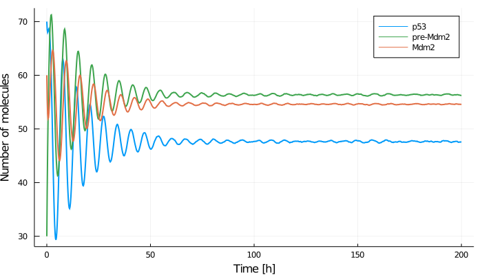
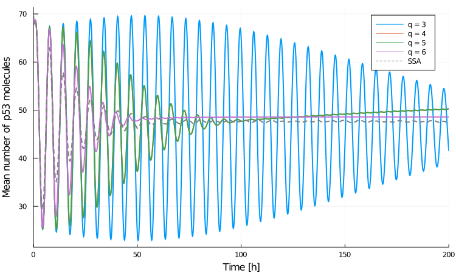

# P53 System Example

In this example tutorial, we consider the oscillatory p53-Mdm2 system which has been studied by [Lakatos et al. (2015)](https://doi.org/10.1063/1.4929837) using central moment expansion up to 5th order with [zero](@ref zero_closure), [normal](@ref normal_closure), [log-normal](@ref log-normal_closure) and [gamma](@ref gamma_closure) closures. We attempt to reproduce a number of results published in their paper.

In contrast to the Brusselator we considered [before](@ref main_tutorial), the p53-Mdm2 system contains non-polynomial propensities and hence is a good showcase for generating central moment equations using different values of $q$ and comparing their accuracy. Note that this was not considered by Lakatos et al. who set $q = m+1$ throughout their study. We remind the reader that $m$ denotes the moment expansion order and $q$ is the order of Taylor expansion of the propensity functions: the moment equations are generated up to $m^{\text{th}}$ order and may include central moments up $q^{\text{th}}$ order so that all moments of orders $m+1, \dotsc, q$  must be approximated using some moment closure method (see the [Moment Expansion theory section](@ref moment_expansion_CME) for more details).

The p53-Mdm2 reaction network is described by the stoichiometric matrix
```math
S = \begin{bmatrix}
     1 & -1 & -1 & 0 & 0 & 0\\
     0 & 0 & 0 & 1 & -1 & 0 \\
     0 & 0 & 0 & 0 & 1 & -1
    \end{bmatrix}
```
and six reaction propensities
```math
\begin{align*}
a_1 &= k_1, \\
a_2 &= k_2 x_, \\
a_3 &= k_3 \frac{x y}{x + k_7}, \\
a_4 &= k_4 x, \\
a_5 &= k_5 y₀, \\
a_6 &= k_6 y,
\end{align*}
```
where the variables are

* number of p53 molecules $x$
* number of precursor of Mdm2 molecules $y_0$
* number of Mdm2 molecules $y$

with parameters
* p53 production rate $k_1$
* Mdm2-independent p53 degradation rate $k_2$
* saturating p53 degradation rate $k_3$
* p53-dependent Mdm2 production rate $k_4$
* Mdm2 maturation rate $k_5$
* Mdm2 degradation rate $k_6$
* p53 threshold for degradation by Mdm2 $k_7$

We begin by loading all the packages we will need
```julia
using Catalyst, MomentClosure, OrdinaryDiffEq, DiffEqJump,
      DiffEqBase.EnsembleAnalysis, Plots, Plots.PlotMeasures
```
and then build the model using Catalyst and set its parameters as follows:
```julia
# → for mass-actions rate
# ⇒ for non mass-actions rate
rn = @reaction_network begin
    (k₁), 0 → x
    (k₂), x → 0
    (k₃*x*y/(x+k₇)), x ⇒ 0
    (k₄*x), 0 ⇒ y₀
    (k₅), y₀ → y
    (k₆), y → 0
end k₁ k₂ k₃ k₄ k₅ k₆ k₇

# parameters [k₁, k₂, k₃, k₄, k₅, k₆, k₇]
p = [90, 0.002, 1.7, 1.1, 0.93, 0.96, 0.01]

# initial molecule numbers [x, y₀, y]
u₀ = [70, 30, 60]
```

Let's first simulate the reaction network using SSA in order to have a reference point of the real system dynamics. We choose a relatively long simulation time span in order to clearly see how the molecule numbers converge to their steady-state values and opt for $5 \times 10^4$ SSA realisations:
```julia
# time interval to solve one on
tspan = (0., 200.)

# constructing the discrete jump problem using DifferentialEquations
jsys = convert(JumpSystem, rn, combinatoric_ratelaws=false)
dprob = DiscreteProblem(jsys, u₀, tspan, p)

jprob = JumpProblem(jsys, dprob, Direct(), save_positions=(false, false))
ensembleprob  = EnsembleProblem(jprob)

# @time is only a rough estimate and not a proper benchmark
@time sol_SSA = solve(ensembleprob, SSAStepper(), saveat=0.2, trajectories=50000)
```
```julia
1332.443829 seconds (2.90 G allocations: 69.838 GiB, 42.81% gc time)
```
Single SSA trajectories show sustained oscillations in molecule numbers:
```julia
plot(sol_SSA[666], labels=["p53" "pre-Mdm2" "Mdm2"], lw=2, tspan=(0., 100.),
     linecolor=[1 3 2], xlabel="Time [h]", ylabel="Number of molecules", size=(700, 400))
```


The mean population dynamics show damped oscillations as the single trajectories get dephased over time and eventually reach steady-state values:
```julia
means_SSA, vars_SSA = timeseries_steps_meanvar(sol_SSA)
plot(means_SSA, labels=["p53" "pre-Mdm2" "Mdm2"], lw=2, linecolor=[1 3 2],
     xlabel="Time [h]", ylabel="Number of molecules", size=(700, 400))
```


Note that many more SSA runs are needed to completely denoise the mean trajectories (especially at later times).

Finally, we can look at the marginal distributions noting a high level of asymmetry at the chosen time point $t=25$:
```julia
data = componentwise_vectors_timepoint(sol_SSA, 25.0)
h1 = histogram(data[1], normalize=true, xlabel="x", ylabel="P(x)")
h2 = histogram(data[2], normalize=true, xlabel="y₀", ylabel="P(y₀)")
h3 = histogram(data[3], normalize=true, xlabel="y", ylabel="P(y)")
using Plots.PlotMeasures
plot(h1, h2, h3, legend=false, layout=(1,3), size = (1050, 250),
     left_margin = 5mm, bottom_margin = 7mm, guidefontsize=10)
```


Given the long runtime of the SSA above, it makes sense to turn to approximation methods such as moment closure which is usually much faster (suitable if only information about moments is needed). We start with the simplest second order, $m =2$, moment expansion and consider normal, log-normal and gamma closures. Our interest here is to see how the accuracy of each closure changes when the Taylor expansion order $q$ is increased. Note that zero closure is equivalent to normal closure when $q=3$ (as third order central moments and cumulants are equivalent) and does not change when $q$ is increased as all the higher order moments will be simply set to zero.

We can generate the corresponding plots of the mean p53 molecule number, $x$, as follows:
```julia
closures = ["normal", "log-normal", "gamma"]

# initialise separate plot for each closure
plts = [plot() for i in 1:length(closures)]

for q in 3:6
    eqs = generate_central_moment_eqs(rn, 2, q, combinatoric_ratelaw=false)
    for (closure, plt) in zip(closures, plts)
        closed_eqs = moment_closure(eqs, closure)

        u₀map = deterministic_IC(u₀, closed_eqs)
        oprob = ODEProblem(closed_eqs, u₀map, tspan, p)

        sol = solve(oprob, Tsit5(), saveat=0.1)
        plt = plot!(plt, sol, vars=(0, 1), lw=3, label  = "q = "*string(q))
    end
end

for plt in plts
    plt = plot!(plt, xlabel = "Time [h]", ylabel = "Mean number of p53 molecules")
    plt = plot!(plt, means_SSA.t, means_SSA[1,:], lw=2, linestyle=:dash, label = "SSA", color="gray")
end
```
Normal closure:
```julia
plot(plts[1], size=(750, 450), leftmargin=2mm)
```


Log-normal closure:
```julia
plot(plts[2], size=(750, 450), leftmargin=2mm)
```


Zoomed-in log-normal closure (to better see the initial dampening in trajectories):
```julia
plot(plts[2], xlims=(0., 50.), lw=3)
```


Gamma closure:
```julia
plot(plts[3], size=(750, 450), leftmargin=2mm)
```


When using normal closure, including central moments all the way up to 6th order ($q=6$) is needed in order to obtain qualitatively correct system behaviour. As the true distribution (as plotted above) is highly asymmetric, one may expect that performing normal closure, i.e., assuming that the system has a (symmetric) Gaussian distribution, is not the most optimal choice. For log-normal and gamma closures, quite accurate predictions are obtained with $q=4$ whereas $q=6$ tends to overestimate the dampening initially but better captures the steady-state behaviour. Note that for odd values of $q$ log-normal and gamma closures introduced numerical instabilities and the moments could not be evaluated for the entire time course.

We can also plot the variance predictions:
```julia
# rerunning the same calculations as they are reasonably fast
plt = plot()
for q in [4,6]
    eqs = generate_central_moment_eqs(rn, 2, q, combinatoric_ratelaw=false)
    for closure in closures
        closed_eqs = moment_closure(eqs, closure)

        u₀map = deterministic_IC(u₀, closed_eqs)
        oprob = ODEProblem(closed_eqs, u₀map, tspan, p)
        sol = solve(oprob, Tsit5(), saveat=0.1)

        # index of M₂₀₀ can be checked with `u₀map` or `closed_eqs.odes.states`
        plt = plot!(plt, sol, vars=(0, 4), lw=3, label  = closure*" q = "*string(q))
    end
end

plt = plot!(plt, xlabel = "Time [h]", ylabel = "Variance of p53 molecule number", legend=:topleft)
plt = plot!(plt, means_SSA.t, vars_SSA[1,:], lw=2, linestyle=:dash, label = "SSA", color="gray")
plot(plt, size=(750, 450))
```


Log-normal closure with $q=6$ clearly gives the best estimate of the variance. Therefore, including increasingly higher-order moment information in second-order moment expansion tends to leads to an overall more accurate statistical description of the P53-Mdm2 system.

We can extend the analysis further by considering higher order moment expansions (increasing $m$). Let's look at third-order expansion with $q$ values 4 and 6 (odd $q$ leads to heavy numerical instabilities as before):
```julia
closures = ["zero", "normal", "log-normal", "gamma"]

plt_means = [plot() for i in 1:2]
plt_vars  = [plot() for i in 1:2]

q_vals = [4, 6]

for (q, plt_m, plt_v) in zip(q_vals, plt_means, plt_vars)

    eqs = generate_central_moment_eqs(rn, 3, q, combinatoric_ratelaw=false)
    for closure in closures

        closed_eqs = moment_closure(eqs, closure)

        u₀map = deterministic_IC(u₀, closed_eqs)
        oprob = ODEProblem(closed_eqs, u₀map, tspan, p)

        sol = solve(oprob, Tsit5(), saveat=0.1)
        plt_m = plot!(plt_m, sol, vars=(0, 1), label = closure)    
        plt_v = plot!(plt_v, sol, vars=(0, 4), label = closure)

    end

    plt_m = plot!(plt_m, means_SSA.t, means_SSA[1,:], title="m = 3, q = "*string(q),
                  linestyle=:dash, label = "SSA", color="gray", legend=false)

    plt_v = plot!(plt_v, vars_SSA.t, vars_SSA[1,:], linestyle=:dash, label = "SSA", color="gray", legend=false)

end

plt_means[1] = plot(plt_means[1], ylabel = "Mean p53 molecule number")
plt_vars[1] = plot(plt_vars[1], ylabel = "Variance of p53 molecule number", legend=:topleft)
plot(plt_means..., plt_vars..., size=(1250, 750), lw=1.5, xlabel="Time [h]",
     guidefontsize=10, titlefontsize=12, legendfontsize=8, leftmargin=4mm, bottommargin=2mm)
```


The results are rather interesting: the mean trajectories initially show the characteristic dampened oscillations, which, however, fail to converge to a steady-state value and instead start growing in amplitude as the time increases—this behaviour is also more pronounced for higher $q$. Surprisingly, log-normal and gamma closures still provide fairly accurate variance estimates. Note that zero closure ODEs fail to be evaluated for the entire time course at all, displaying strongly oscillatory mean trajectories and even exponentially growing variances. Therefore, third order moment expansion and all of the applied closure methods fail to give physically meaningful results.

This outcome seems concerning as [Lakatos et al. (2015)](https://doi.org/10.1063/1.4929837) state that the same closures reached steady-state at extended simulation time (using identical parameter set). In order to investigate this discrepancy further, we turn to Python [MEANS](https://github.com/theosysbio/means) package, the implementation of which is fully based on the technical details presented in [Lakatos et al. (2015)](https://doi.org/10.1063/1.4929837). Note that the package has not been maintained for years, only works on Python 2 and setting up its dependencies may be fiddly. Nevertheless, having done that, we can generate and solve the moment equations up to third order running the following code in a *separate* Python 2 notebook:
```Python
import means
import means.examples
import numpy as np
import matplotlib.pyplot as plt

sys = means.examples.MODEL_P53

ps = [90, 0.002, 1.7, 1.1, 0.93, 0.96, 0.01]
ic_values = [70, 30, 60]

tspan = np.arange(0, 200, 0.1)

plt.figure(figsize=(10,6))

for closure in ["normal", "log-normal", "gamma"]:
    odes = means.mea_approximation(sys, 3, closure=closure, multivariate=True)
    simulation = means.Simulation(odes)
    trajectories = simulation.simulate_system(ps, ic_values, tspan)
    trajectories[0].plot(label=closure)

plt.margins(x=0)
plt.xlabel('Time [h]', fontsize=12)
plt.ylabel('Mean p53 molecule number', fontsize=12)
plt.tick_params(axis='both', which='major', labelsize=10)
plt.legend(fontsize=12)
plt.show()
```


We observe that the mean trajectories fail to converge after all, hinting that some of the results published in [Lakatos et al. (2015)](https://doi.org/10.1063/1.4929837) may benefit from a more critical analysis. Note that MEANS does not allow arbitrary $q$ values and automatically sets $q = m+1$, hence third-order moment expansion using MEANS is equivalent to our $m=3, q=4$ case.

We stress that the obtained mean trajectories using the two packages are not identical due to different implementations of the closure methods (different solvers do not have a significant effect in this case). [Lakatos et al. (2015)](https://doi.org/10.1063/1.4929837) (and hence MEANS) formulate the normal, log-normal and gamma closure functions exclusively in terms of first and second order moments—higher order moments, whose corresponding ODEs are being solved for simultaneously, are not included in the construction of closure functions. One could say that such formulation makes a stronger assumption about the underlying distribution and does not utilise all the information available about the system—our implementation takes that into account. For example, in case of $m=3, q=4$ moment expansion, we approximate the fourth order central moments in terms of third and lower order moments, whereas MEANS would approximate it using only first and second order moments. Curiously, MEANS formulation appears to be more numerically stable (shows weaker oscillations) at longer times in this particular case, as can be seen from the plots above. Nevertheless, as both approaches failed to produce physically meaningful results, we do not investigate the numerical differences further—one would still generally expect that the inclusion of the computed higher-order moment values will improve the numerical stability of the ODEs and the accuracy of moment estimates.

Finally, we can check whether better estimates can be obtained using even higher, fifth, order expansion with $q=6$:
```julia
plt = plot()
closures = ["zero", "normal", "log-normal", "gamma"]

eqs = generate_central_moment_eqs(rn, 5, 6, combinatoric_ratelaw=false)
# faster to store than recompute in case we want to try different solvers/params
oprobs = Dict()

for closure in closures
    closed_eqs = moment_closure(eqs, closure)

    u₀map = deterministic_IC(u₀, closed_eqs)
    oprobs[closure] = ODEProblem(closed_eqs, u₀map, tspan, p)
    sol = solve(oprobs[closure], Tsit5(), saveat=0.1)

    plt = plot!(plt, sol, vars=(0, 1), label = closure)    
end

plt = plot!(plt, xlabel = "Time [h]", ylabel = "Mean p53 molecule number")
plt = plot!(plt, means_SSA.t, means_SSA[1, :], linestyle=:dash, label = "SSA", color="gray")
plot(plt, size=(750, 450), lw=2)
```


All closures are highly numerically unstable and fail to provide physically meaningful results. Performing similar fifth order moment expansion using the MEANS package we obtain (full code can be found in the example Jupyter notebook):


Note that normal closure is not included in the plot as it failed to converge using MEANS while log-normal and gamma closures seem to be much more stable in comparison to MomentClosure results (albeit still unphysical). In contrast, normal closure is the only one which succeeded in being evaluated for the entire time course using MomentClosure (full time not shown in the plot) which again is a result of the implementational differences between the two packages.
