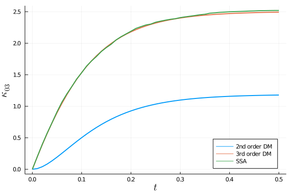

# [Derivative Matching Example](@id derivative-matching-example)

In this example, we aim to reproduce a number of results from the original [derivative matching](@ref derivative_matching) paper by Singh and Hespanha [1]. We consider the bimolecular reaction system given by:
```math
\begin{align*}
X_1 &\stackrel{c_1}{\rightarrow} 2X_1 + X_2, \\
X_1 + X_2&\stackrel{c_2}{\rightarrow} X_2.
\end{align*}
```
The reaction network and its parameters can be defined as follows:
```julia
using Catalyst

rn = @reaction_network begin
    @parameters c₁ c₂
    (c₁), x₁ → 2x₁+x₂
    (c₂), x₁+x₂ → x₂
end

# parameter values
p = [:c₁ => 1.0, :c₂ => 1.0]
# initial conditions
u0 = [20, 10]
# time interval to solve on
tspan = (0., 0.5)
```
We are interested in extracting the time-evolution of a specific third order cumulant, $κ_{03}$, using second and third order moment expansions with derivative matching, and comparing the obtained estimates to the SSA prediction.

Let's start with a second order moment expansion and print out the third-order moment closure functions obtained with derivative matching:
```julia
using MomentClosure, Latexify

eqs2 = generate_raw_moment_eqs(rn, 2)
dm2_eqs = moment_closure(eqs2, "derivative matching")
latexify(dm2_eqs, :closure, print_all=true)
```
```math
\begin{align*}
\mu{_{30}} =& \mu{_{10}}^{-3} \mu{_{20}}^{3} \\
\mu{_{21}} =& \mu{_{20}} \mu{_{01}}^{-1} \mu{_{10}}^{-2} \mu{_{11}}^{2} \\
\mu{_{12}} =& \mu{_{02}} \mu{_{01}}^{-2} \mu{_{10}}^{-1} \mu{_{11}}^{2} \\
\mu{_{03}} =& \mu{_{01}}^{-3} \mu{_{02}}^{3}
\end{align*}
```
Note that all closure functions are consistent with the ones shown in Table II of [1]. We can then move on to solving the generated system of moment ODEs:
```julia
using OrdinaryDiffEqTsit5

u0map = deterministic_IC(u0, dm2_eqs) # assuming deterministic initial conditions
oprob = ODEProblem(dm2_eqs, u0map, tspan, p)
dm2_sol = solve(oprob, Tsit5(), saveat=0.01)
```
Now the question is how can we extract the time evolution of the cumulant $\kappa_{03}$. Firstly, note that using the standard moment relationships it can be expressed in terms of raw moments as:
```math
\begin{align*}
\kappa_{03} = 2 \mu_{01}^3 - 3\mu_{02}\mu_{01} + \mu_{03}
\end{align*}
```
As we were solving for moments up to second order, we do not have any direct information on the third order moment $\mu_{03}$. Nevertheless, we can manually approximate it using the corresponding closure function given above, i.e., $\mu_{03} = \mu_{01}^{-3} \mu_{02}^{3}$. The time trajectories of $\mu_{01}$ and $\mu_{02}$ can be extracted from `dm2_sol` and their order in the array can be checked with:
```julia
unknowns(dm2_eqs.odes)
```
```julia
5-element Array{Term{Real,Nothing},1}:
 μ₁₀(t)
 μ₀₁(t)
 μ₂₀(t)
 μ₁₁(t)
 μ₀₂(t)
```
Finally, we can combine all the steps to obtain the $\kappa_{03}$ estimate:
```julia
μ₀₁ = dm2_sol[2, :]
μ₀₂ = dm2_sol[5, :]
μ₀₃ = (μ₀₁ .^(-3)) .* (μ₀₂ .^3)
dm2_κ₀₃ = 2 .* μ₀₁ .^3 .- 3 .* μ₀₂ .* μ₀₁ .+ μ₀₃
```
Next we consider a third order moment expansion:
```julia
eqs3 = generate_raw_moment_eqs(rn, 3)
dm3_eqs = moment_closure(eqs3, "derivative matching")
latexify(dm3_eqs, :closure, print_all=true)
```
```math
\begin{align*}
\mu{_{40}} =& \mu{_{10}}^{4} \mu{_{20}}^{-6} \mu{_{30}}^{4} \\
\mu{_{31}} =& \mu{_{01}} \mu{_{30}} \mu{_{10}}^{3} \mu{_{11}}^{-3} \mu{_{20}}^{-3} \mu{_{21}}^{3} \\
\mu{_{22}} =& \mu{_{01}}^{2} \mu{_{02}}^{-1} \mu{_{10}}^{2} \mu{_{11}}^{-4} \mu{_{12}}^{2} \mu{_{20}}^{-1} \mu{_{21}}^{2} \\
\mu{_{13}} =& \mu{_{03}} \mu{_{10}} \mu{_{01}}^{3} \mu{_{02}}^{-3} \mu{_{11}}^{-3} \mu{_{12}}^{3} \\
\mu{_{04}} =& \mu{_{01}}^{4} \mu{_{02}}^{-6} \mu{_{03}}^{4}
\end{align*}
```
As expected, the closure functions agree with those given in Table III of [1]. We again check the order of variables
```julia
unknowns(dm3_eqs.odes)
```
```julia
9-element Array{Term{Real,Nothing},1}:
 μ₁₀(t)
 μ₀₁(t)
 μ₂₀(t)
 μ₁₁(t)
 μ₀₂(t)
 μ₃₀(t)
 μ₂₁(t)
 μ₁₂(t)
 μ₀₃(t)
```
and solve the moment equations, computing the required cumulant:
```julia
u0map = deterministic_IC(u0, dm3_eqs)
oprob = ODEProblem(dm3_eqs, u0map, tspan, p)
dm3_sol = solve(oprob, Tsit5(), saveat=0.01, abstol=1e-8, reltol=1e-8)

μ₀₁ = dm3_sol[2,:]
μ₀₂ = dm3_sol[5,:]
μ₀₃ = dm3_sol[9,:]
dm3_κ₀₃ = 2 .* μ₀₁ .^ 3 - 3 .* μ₀₂ .* μ₀₁ .+ μ₀₃
```
Note that we could have also obtained $\kappa_{03}$ estimate in an easier way by using central moment equations, as third order central moments are equal to the corresponding third order cumulants:
```julia
central_eqs3 = generate_central_moment_eqs(rn, 3)
dm3_central_eqs = moment_closure(central_eqs3, "derivative matching")

u0map = deterministic_IC(u0, dm3_central_eqs)
oprob = ODEProblem(dm3_central_eqs, u0map, tspan, p)
dm3_central_sol = solve(oprob, Tsit5(), saveat=0.01, abstol=1e-8, reltol=1e-8)

# check that the two estimates are equivalent
dm3_κ₀₃ ≈ dm3_central_sol[9,:]
```
```julia
true
```
The last ingredient we need for a proper comparison between the second and third order moment expansions is a reference value predicted by the SSA. We can simulate $10^5$ SSA trajectories as follows:
```julia
using JumpProcesses

dprob = DiscreteProblem(rn, u0, tspan, p)
jprob = JumpProblem(rn, dprob, Direct(), save_positions=(false, false))

ensembleprob  = EnsembleProblem(jprob)
sol_SSA = solve(ensembleprob, SSAStepper(), saveat=0.01, trajectories=100000)
```
The time evolution of $\kappa_{03}$ can be extracted from SSA data using the [`get_cumulants`](@ref) function:
```julia
ssa_κ₀₃ = get_cumulants(sol_SSA, 3)[0, 3]
```
Finally, we plot the results:
```julia
using Plots, LaTeXStrings

plot(dm2_sol.t, dm2_κ₀₃, lw=2, label="2nd order DM")
plot!(dm2_sol.t, dm3_κ₀₃, lw=2, label="3rd order DM")
plot!(dm2_sol.t, ssa_κ₀₃, lw=2, label="SSA")
plot!(ylabel=L"\kappa_{03}", xlabel=L"t", guidefontsize=14, legend=:bottomright)
```


We observe that the third order moment truncation using derivative matching performs significantly better than the second order truncation, accurately matching the true SSA prediction (consistent with the figure in [1]).

It is also interesting to note that the closure functions of third order moments obtained using [derivative matching](@ref derivative_matching) and [log-normal](@ref log-normal_closure) closures are equivalent. We can see that it is indeed the case by printing out the log-normal closure functions
```julia
ln2_eqs = moment_closure(eqs2, "log-normal")
latexify(ln2_eqs, :closure, print_all=true)
```
```math
\begin{align*}
\mu{_{30}} =& \mu{_{10}}^{-3} \mu{_{20}}^{3} \\
\mu{_{21}} =& \mu{_{20}} \mu{_{01}}^{-1} \mu{_{10}}^{-2} \mu{_{11}}^{2} \\
\mu{_{12}} =& \mu{_{02}} \mu{_{01}}^{-2} \mu{_{10}}^{-1} \mu{_{11}}^{2} \\
\mu{_{03}} =& \mu{_{01}}^{-3} \mu{_{02}}^{3}
\end{align*}
```
and the corresponding derivative matching functions obtained previously:
```julia
latexify(dm2_eqs, :closure, print_all=true)
```
```math
\begin{align*}
\mu{_{30}} =& \mu{_{10}}^{-3} \mu{_{20}}^{3} \\
\mu{_{21}} =& \mu{_{20}} \mu{_{01}}^{-1} \mu{_{10}}^{-2} \mu{_{11}}^{2} \\
\mu{_{12}} =& \mu{_{02}} \mu{_{01}}^{-2} \mu{_{10}}^{-1} \mu{_{11}}^{2} \\
\mu{_{03}} =& \mu{_{01}}^{-3} \mu{_{02}}^{3}
\end{align*}
```
However, the equivalence holds only for third order moments. For example, the closure functions of fourth order moments differ:
```julia
ln3_eqs = moment_closure(eqs3, "log-normal")
latexify(ln3_eqs, :closure, print_all=true)
```
```math
\begin{align*}
\mu{_{40}} =& \mu{_{10}}^{-8} \mu{_{20}}^{6} \\
\mu{_{31}} =& \mu{_{01}}^{-2} \mu{_{10}}^{-6} \mu{_{11}}^{3} \mu{_{20}}^{3} \\
\mu{_{22}} =& \mu{_{02}} \mu{_{20}} \mu{_{01}}^{-4} \mu{_{10}}^{-4} \mu{_{11}}^{4} \\
\mu{_{13}} =& \mu{_{01}}^{-6} \mu{_{02}}^{3} \mu{_{10}}^{-2} \mu{_{11}}^{3} \\
\mu{_{04}} =& \mu{_{01}}^{-8} \mu{_{02}}^{6}
\end{align*}
```
```julia
latexify(dm3_eqs, :closure, print_all=true)
```
```math
\begin{align*}
\mu{_{40}} =& \mu{_{10}}^{4} \mu{_{20}}^{-6} \mu{_{30}}^{4} \\
\mu{_{31}} =& \mu{_{01}} \mu{_{30}} \mu{_{10}}^{3} \mu{_{11}}^{-3} \mu{_{20}}^{-3} \mu{_{21}}^{3} \\
\mu{_{22}} =& \mu{_{01}}^{2} \mu{_{02}}^{-1} \mu{_{10}}^{2} \mu{_{11}}^{-4} \mu{_{12}}^{2} \mu{_{20}}^{-1} \mu{_{21}}^{2} \\
\mu{_{13}} =& \mu{_{03}} \mu{_{10}} \mu{_{01}}^{3} \mu{_{02}}^{-3} \mu{_{11}}^{-3} \mu{_{12}}^{3} \\
\mu{_{04}} =& \mu{_{01}}^{4} \mu{_{02}}^{-6} \mu{_{03}}^{4}
\end{align*}
```
This difference is expected as fourth order moments using log-normal closure are expressed exclusively in terms of first and second order moments, whereas derivative matching additionally incorporates third order moment information. Singh and Hespanha [1, 2] elaborate on this point: as there is no unique way to define higher order moment closure functions for log-normal distribution, both closures are consistent with the assumption that the population is jointly log-normally distributed. We urge the reader to consult the mentioned papers [1, 2] and the references therein for a more complete discussion comparing the two approaches.

## References

[1]: A.  Singh  and  J.  P.  Hespanha,  "Lognormal  Moment  Closures  for  Biochemical  Reactions", in Proceedings of the 45th IEEE Conference on Decision and Control, ISSN:0191-2216 (Dec. 2006), pp. 2063–2068. [https://doi.org/10.1109/CDC.2006.376994](https://doi.org/10.1109/CDC.2006.376994)

[2]: A. Singh and J. P. Hespanha, "Approximate Moment Dynamics for Chemically Reacting Systems", IEEE Transactions on Automatic Control 56, 414–418 (2011). [https://doi.org/10.1109/TAC.2010.2088631](https://doi.org/10.1109/TAC.2010.2088631)
